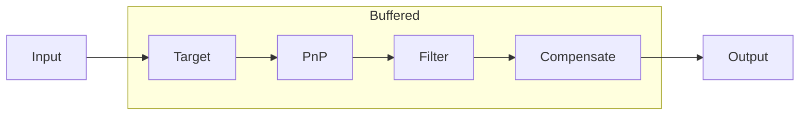
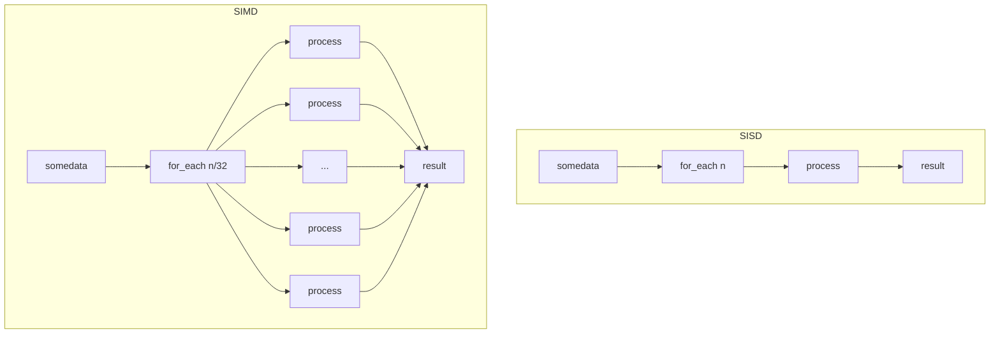
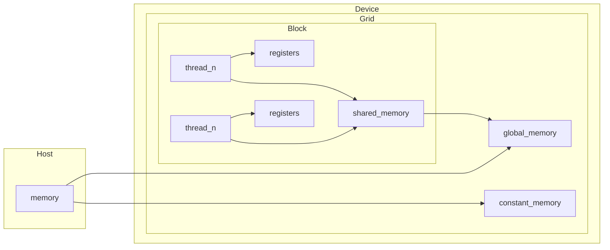
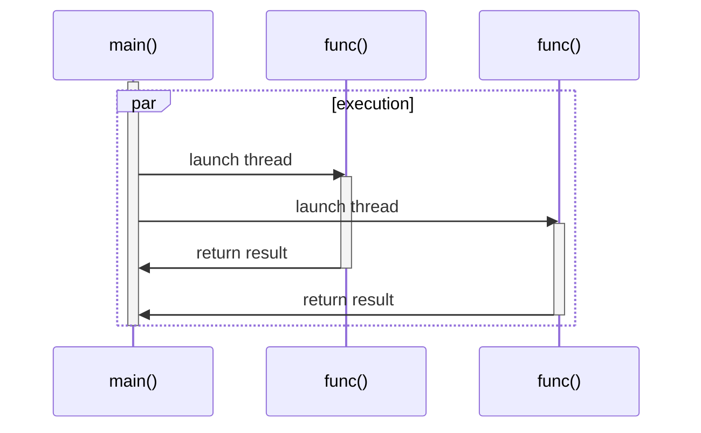
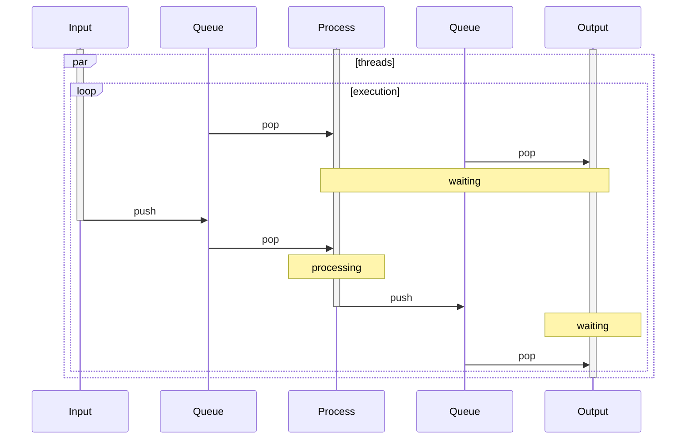
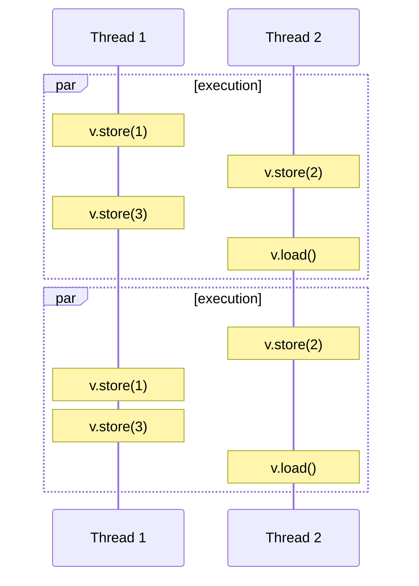

Engineers have been implementing many basic vision features on computers in the past half century.

Here I want to share some experience about implementing low latency and high performance vision architecture with [OpenCV](https://opencv.org/), mainly including instruction set optimization, CUDA programming and multi-threaded programming based on the C++ standard library.

<!-- more -->

## What is it?

If you have ever known RoboMaster competition which held by [DJI](https://www.dji.com/), you will quickly understand what we need to do. In a nutshell, it has a following flow:



**Input** obtains data from the outside environment, generally they are camera images and some parameters provided by the serial devices, and **Target** calculates the position of the target on the 2D image by processing these input data (or already processed loopback data), combined with its position and shape characteristics of the target on the 2D image, the approximate position in real space can be predicted by the **PnP** algorithm and kalman **Filter**. Finally, its future position in the real environment is predicted and we take action after the ballistics is **Compensated**, by sending the position data from the **Output** serial device to the underlying devices.

The above process is not complicated, but each step is interlocked, while performing the next recognition, it may also need to use the previous recognition results, this is the data loopback. Therefore, the efficiency improvement of each step may bring greater benefits in macro, which is why we have been trying to improve the recognition speed.

Of course, faster recognition speed is only one side of the coin, because faster recognition speed leads to more information, but not all of these data meaningful, because some may contain a lot of noise. To solve that requires a more pronounced temporal dimension, so we need to improve the data structure and the algorithms for processing the additional information.

Moreover, this is not limited to competitions, but in life the visual recognition of roads by self-driving cars, visual inspection robots on assembly lines, etc. All have high requirements for the speed of visual recognition. In today's world of multiple CPU and multicore computers, we are eager for traditional streaming vision processing algorithms to run better on multiple cores for faster recognition.

## Catching the tail of instructions

Within each task, there are still many micro senses of parallelism or concurrency that are meaningful to increase the processing speed of a single task, which is one of the main reasons that we still choose C or C++ languages thesedays. In addition, choosing the right computing device (CPU or GPU) for different data types or algorithms can often lead to significant speedups.

### SIMD

In the early days of computers, [von Neumann architecture](https://en.wikipedia.org/wiki/Von_Neumann_architecture) computers were able to manipulate only one pair of data by one instruction at a time, which is called "Single Instruction Stream, Single Data Stream". Obviously, this method of manipulating data is inefficient when dealing with large amounts of data, so what can programmers do if they want to make a single operation work on multiple sets of data? The idea of "Single Instruction Stream, Multiple Data Stream" was introduced, which makes it possible to manipulate multiple sets of data with a single instruction.



In the process of acquiring **Target**, sometimes we need to extract a channel of the RGB image read by the camera and convert it to a binary image. Suppose we need to write a function to threshold a channel into a binary image, and we iterate through the pixel points in `_src`:

```cpp
void threshold(const uint8_t* _src, const uint8_t* dst_, const size_t& _size, const uint8_t& _lower, const uint8_t& _upper) {
    for (size_t i = 0; i != _size; ++i) { dst_[i] = _src[i] >= _lower && _src[i] <= _upper ? UINT8_MAX : 0; }
}
```

However, a lot of CPU resources are consumed by repeatedly executing the same instructions to determine whether `_src[i]` is within the threshold range, including the condition instructions of whether the pixel traversal is completed. If there is a large amount of data to process, it is unwise to execute the same instruction operation N times. Modern processors, from the x86 processor's SSE to AVX and ARM processor's [NEON](https://developer.arm.com/documentation/dht0002/a/Introducing-NEON/NEON-architecture-overview/NEON-instructions), almost all have their own SIMD implementations to allow developers to operation multiple sets of data by a single instruction. Here is an example of how NEON instruction set can make the threshold exponentially faster:

```cpp
void threshold(const uint8_t* _src, uint8_t* dst_, const std::size_t& _size, const uint8_t& _lower, const uint8_t& _upper) {
    const auto block   { _size / 32 };
    const auto lower_b { vdupq_n_u8(_lower) };
    const auto upper_b { vdupq_n_u8(_upper) };

    for (std::size_t i = 0; i != block; ++i, _src += 32, dst_ += 32) {
        const auto blk_l { vld1q_u8(_src) };
        const auto blk_r { vld1q_u8(_src + 16) };
        const auto res_l { vandq_u8(vcltq_u8(blk_l, upper_b), vcgtq_u8(blk_l, lower_b)) };
        const auto res_r { vandq_u8(vcltq_u8(blk_r, upper_b), vcgtq_u8(blk_r, lower_b)) };
        vst1q_u8(dst_, res_l);
        vst1q_u8(dst_ + 16, res_r);
    }
}
```

Assuming that the number of data to be processed is an integer multiple of 32, the size of the block (the number of elements to be processed each time) can be set to 32, and the 32 elements to be processed each time are divided into two small blocks `blk_l` and `blk_r`, each containing 16 elements. and deposit them into `dst_`, which means the process have complete. Note that if there is not enough data to process, it is often necessary to fill in the data manually. For data that is not an integer multiple of 32, consider taking a 16 elements chunk at the end of the data and processing the remaining elements (less than 16) in the traditional way.

Fortunately, the third-party library [Carotene](https://github.com/opencv/opencv/tree/master/3rdparty/carotene) of OpenCV already uses the NEON instruction set to accelerate these basic image processing algorithms. Prefer using Carotene for devices with ARM processors (e.g. `threshold` functions, OpenCV uses OpenCL implementation by default). Last but not least, note that some compiler optimization flags actually do auto-vectorization for us, like `-O1` enables advanced SIMD optimization automatically while compiling.

### GPU

For different computing scenarios, engineers have designed different types of processors for computing, CPU and GPU. For example, CPU requires the generality to handle a variety of data types, and logical judgments introduce a large number of branch jumps and interrupts, all of these make the internal structure of CPU extremely complex, on the other hand, GPU faces a highly uniform type of large-scale data without interdependencies and a pure computing environment without interruptions.

The GPU is actually a SIMD architecture device. Here we take NVIDIA's GPU as an example and use the [CUDA SDK](https://developer.nvidia.com/zh-cn/cuda-toolkit) to develop, dividing the `gthreshold` function into 32 threads in the GPU grid and using `threadIdx` for thread synchronization to implement the threshold algorithm as described above:

```cpp
__global__ void gthreshold(const void* _gsrc, const void* gdst_, const std::size_t _size, const uint8_t _lower, const uint8_t _upper) {
    const int     idx  { threadIdx.x };
    const uint8_t gsrc { _gsrc[idx] };
    if (idx < _size) { gdst_[idx] = gsrc >= _lower && gsrc <= _upper ? UINT8_MAX : 0; }
}

void threshold(const void* _gsrc, const void* gdst_, const std::size_t& _size, const uint8_t& _lower, const uint8_t& _upper) {
    gthreshold<<<1, 32>>>(_gsrc, gdst_, _size, _lower, _upper);
    cudaDeviceSynchronize();
}
```

Note that the `_gsrc` and `gdst_` pointers point to data in the GPU's memory, so how do we use the data in host memory? Assuming that `src` and `dst` are one-dimensional array pointers of type `unit8_t`, similar to the `GpuMat` of OpenCV, they are usually copied directly form host memory in the following way:

```cpp
cudaMalloc(gsrc, size * sizeof(uint8_t));
cudaMalloc(gdst, size * sizeof(uint8_t));
cudaMemcpy(gsrc, src, size * sizeof(uint8_t), cudaMemcpyHostToDevice);

threshold(gsrc, gdst, size, lower, upper); // do some processing

cudaMemcpy(dst, gdst, size * sizeof(uint8_t), cudaMemcpyDeviceToHost);
cudaFree(gsrc);
cudaFree(gdst);
```

First, use the `cudaMalloc` function to allocate `gsrc` and `gdst` in the GPU memory, exchange data between the Host (CPU) and Device (GPU) with the `cudaMemcpy` function, wait for processing to complete, copy the processed data back to the host memory, and clean up the memory just allocated in the GPU device.

The above is just a very primitive implementation. In real-world application scenarios, the allocated GPU memory can be reused in most cases, a single step often includes multiple processing methods that need to be run in the GPU, and does not need to be copied back between host and device, or do reallocation. Thus, the differentiation between GPU and CPU poses some difficulties for memory management, which is a problem that must be solved for low-latency vision algorithms. For the memory model between host and device, see the following flowchart:



The **attribute** of each variable or function determines its memory location and life cycle:

- `int local_var` - available in *thread*, stored in *register*, life time inside *thread*
- `__device__ int global_var` - available in *grid*, stored in *global memory*, life time inside *application*
- `__device__ __shared__ int shared_var` - available in *block*, stored in *shared memory*, life time inside *block*
- `__device__ __constant__ int constant_var` - available in *grid*, stored in *constant memory*, life time inside *application*

Maybe someone will mention [Zero Copy](https://docs.nvidia.com/cuda/cuda-c-best-practices-guide/index.html#zero-copy) or [Unified Memory](https://docs.nvidia.com/cuda/cuda-c-programming-guide/index.html#um-introduction), which are indeed good ideas, and here are some examples of the `threshold` functions regarding them:

- Zero Copy

  A feature of the CUDA programming model that enables GPU threads to access host memory directly, which means host and device are using the same physical memory. Note that for CUDA 8.x and below, fixed memory is not pagable, which means that shared memory areas are not contiguous. In a non-coherent environment, pages are not cached and every access to the GPU will use system memory directly, resulting higher latency and lower bandwidth.

  ```cpp
  cudaSetDeviceFlags(cudaDeviceMapHost);
  cudaHostAlloc(static_cast<void *>(src), size * sizeof(uint8_t), cudaHostAllocMapped); // uint8_t* src
  cudaHostAlloc(static_cast<void *>(dst), size * sizeof(uint8_t), cudaHostAllocMapped); // uint8_t* dst

  initialize(src); // initialize src for processing

  cudaHostGetDevicePointer(gsrc, static_cast<void *>(src), 0); // void* gsrc
  cudaHostGetDevicePointer(gdst, static_cast<void *>(dst), 0); // void* gdst

  threshold(gsrc, gdst, size, lower, upper); // do some processing
  ```

- Unified Memory

  A component of the CUDA programming model, it defines a managed memory space where host and device can share a common address space and contiguous virtual memory area. It is important to note that even though memory areas are shared via address space (a single pointer to the same virtual area), this does not mean that the same physical memory space is shared. Simply put, the main purpose of using unified memory is not to reduce execution time or improve performance, but to write simpler, more maintainable code.

  ```cpp
  cudaMallocManaged(&static_cast<void *>(src), size * sizeof(uint8_t)); // uint8_t* src
  cudaMallocManaged(&static_cast<void *>(dst), size * sizeof(uint8_t)); // uint8_t* dst

  initialize(src); // initialize src for processing

  threshold(static_cast<void *>(src), static_cast<void *>(dst), size, lower, upper); // do some processing
  ```

On traditional PC, zero copy and unified memory are essentially dependent on PCIE bandwidth due to the physical hardware separation of host memory and device memory. On *Jetson TX1/TX2* which uses **Pascal architecture**, that zero copy will incur higher latency and more bandwidth usage, as each shared memory access by the GPU will result in a cache expiration and must be transferred again from host memory. However, *Jetson AGX Xavier* begins to use the **Volta architecture** with cache coherency between the CPU and GPU processing units, allowing zero copy programming to be used to share physical memory between the GPU processing units and the host, thus reduced latency overhead and bandwidth usage.

In summary, the proper use of zero copy and unified memory often requires consideration of the hardware conditions, and these memory management models were developed to be compatible with extreme use cases only, not to solve the problem completely. OpenCV provides a number of image processing algorithms that use GPU operations, but still uses the direct copy strategy for memory management. All in all, GPU computation is made for scenarios where it is more suited to computationally intensive programs that spend most of their runtime on register operations (e.g. neural network-based algorithms) rather than on computations that involve frequent memory swapping.

## Simple Asynchrony and Parallelism

Going back to the title, we need to redefine "low latency". In fact, there are two requirements for low latency: the first is to build **Input** and **Output** streams quickly for each cold start, and the second is to have faster processing speed for each processing. The algorithms used to achieve low latency are different for different processing scenarios, so let's use simple asynchronous and parallel algorithms in our code as much as possible before we start building a concurrent processing architecture.

### Asynchronous

From the first point, here we explore how to quickly build input and output streams. Assuming there are many modules that need to be initialized and self-tested before we start target tracing, and each module takes a certain amount of time to initialize and self-test, so suppose we need to initialize a camera module as an **Input** source:

```cpp
namespace device::camera {
    auto init(const std::string& _config_path) {
        std::this_thread::sleep_for(100ms);
        return true;
    }
}
```

During the time while initializing the camera, we are just waiting in the main thread because we are eager to know the result of the initialization before proceeding the initialization of the other modules. In fact most modules are designed to be independent from each other, so there is no need to wait for the initialization of one module to complete before proceeding the others, and the order of execution we would expect is look like this:



So we simply used `std::thread` to initialize the current module while initializing other modules in different threads, with the initialization results stored in `camera_status`:

```cpp
auto init_camera_thr {
    std::thread([&] { camera_status = device::camera::init(config_path); })
};

// init other modules

init_camera_thr.join();
```

The thread will block at `thread::join` until initialization is complete. This simple and brute-force design, however, poses some problems. We can't handle the return value of the function very well, and if we don't design the timeout throw within `camera::init`, and the initialization may gets stuck at some step, the thread would block at `thread::join` forever.

Fortunately, the standard library provides us a way to deal with these problems, which is `std::future`, `future` is the result of an asynchronous operation, typically obtained via `std::promise::get_future`. When the computation is complete, the `set_value` function of `promise` is called to set the return value, and the corresponding `future::get` function blocks the current thread until `promise` returns the value:

```cpp
template <typename F, typename... P, typename R = std::invoke_result_t<std::decay_t<F>, std::decay_t<P>...>>
auto async(F&& _func, P&&... _parms) {
    std::promise<R> pms;
    auto ftr { pms.get_future() };
    auto thr { std::thread([_pms = std::move(pms), __func = std::forward<F>(_func), ...__parms = std::forward<P>(_parms)]() mutable {
        // set_value(void) is invaild, use constexpr to deduce the type of R in compile time
        if constexpr (std::is_void_v<R>) {
            __func(__parms...);
            _pms.set_value();
        } else { _pms.set_value(__func(__parms...)); }
    }) };
    thr.detach();
    return ftr;
}
```

Parameter pack wraps the incoming arguments of lambda expressions, uses `std::invoke_result_t` to infer the return value type from the incoming arguments of the lambda expressions to determine the declaration type of `std::promise`, and moves `pms` to the newly created thread using `std::move` to the newly created thread to avoid `pms` being destructed after `ftr` is returned. If you need to detect if a value has been returned for a period of time, you can use the `future::wait_for` function. A roughly use is in the following way:

```cpp
auto init_camera_ftr {
    async([&](const auto& _config_path) { return device::camera::init(_config_path); }, config_path)
};

// init other modules

while (init_camera_ftr.wait_for(10ms) == std::future_status::timeout) {
    static std::size_t counter { 15 };
    if (--counter) { throw std::runtime_error("Init camera timeout...\n"); }
}
auto camera_status { init_camera_ftr.get() };
```

Wait, isn't that just `std::async`, so why write it ourselves? Sure, but not exactly true, you can think it as a very condensed draft version. The reasons for not using the standard library's `std::async` for example are manifold. Firstly, I had to build a simple example of how `async` based on `std::future` is implemented in order to give the reader a better understanding of how it works (it does work, of course). Secondly, the implementation of `std::async` is different on different platforms, there is no guarantee that the conclusions I abstracted are absolutely correct, because the C++ standard does not specify whether the asynchronous thread is a new thread (GCC/Clang) or reused from a thread pool (MSVC), depending on the compiler's implementation. But finally, let's talk about the `std::async` startup strategy:

- `std::launch::async` - run a new thread to execute the task asynchronously
- `std::launch::deferred` - execute the last set task when its result is requested for the first time (lazy computing)

We want the initialization of all modules to be executed in parallel, so we choose the first launch strategy, using `std::async` with `init_camera` written roughly as follows:

```cpp
auto init_camera_ftr {
    std::async(std::launch::async, [&](const auto& _config_path) { return device::camera::init(_config_path); }, config_path)
};
```

These are just simple callback functions, and probably don't need to use something as bulky as `std::future`. Someone might mention C++ 20's coroutine, and indeed I considered using its implementation, but after thinking that refactoring the entire code into `task<>` would be a big job, I would like to leave its implementation in the future, so stay tuned.

### Parallelism

Parallelism, as the name implies, means that multiple tasks are performed simultaneously at the same time, similar to the idea of SIMD in the previous section, but with a significant difference. Imagine that in some processing, there are many candidate targets, which in reality could be `contours` or `rects`, for example, defined here for convenience as numbers from 0-9, stored in the container `v`:

```cpp
std::vector<std::size_t> v(10);
std::iota(v.begin(), v.end(), 0);
```

So which targets are the ones I need to consider? We often need to make complex judgments about them, such as whether the target satisfies a certain ratio or contains a certain pattern, such macroscopic parallelism cannot be done directly by instruction set optimization. Assuming that the desired targets are the odd ones here, we get the iterator `it` that points to these targets via `std::partition` without copying them, which is easily obtained using modern C++ writes (of course it is also good to use the traditional ways to record the index of the satisfied target elements in the container, which is not demonstrated here):

```cpp
const auto it {
    std::partition(v.begin(), v.end(), [](const auto& _v) { return _v % 2 != 1; })
};
std::copy(it, v.end(), std::ostream_iterator<std::size_t>(std::cout, " ")); // 1 3 5 7 9 (maybe)
```

Is that all that's needed? Of course not, if we judge them one by one, it's like having only one queue but having many service windows (assuming the processors are multi-core), which is very inefficient, and we don't want to use `thread` or `async` as huge abstractions for this kind of small, local and non-synchronous processing, so is there an abstraction for this kind of scenario?

That's why I hava to mention `std::execution` here, since C++17, this can be used to determine the execution policy of parallel algorithms in the standard library, and there are 3 commonly used execution policies (see [execution](https://zh.cppreference.com/w/cpp/algorithm/) for more):

- `std::execution::seq` - keep the original execution order, no parallelism
- `std::execution::par` - parallelize, structure still has the original execution order
- `std::execution::par_unseq` - parallelize and [vectorize](https://en.wikipedia.org/wiki/Automatic_vectorization) (requires that operations be interleaved, no mutexes are obtained)

Here we use `std::execution::par_unseq` to parallelize our tasks in the most relaxed way, with a simple modification to the call to `std::partition`:

```cpp
const auto it {
    std::partition(std::execution::par_unseq, v.begin(), v.end(), [](const auto& _v) { return _v % 2 != 1; })
};
```

If you need to save some temporary data from the judgment process, things get a little more complicated. First, using a parallelized execution strategy causes `std::back_inserter` to be unsafe (including the `push_back` and `emplace_back` operations of the standard library containers), because it is likely that these operations may occur simultaneously. Second, it is also undesirable to preconstruct a temporary container of the same length as `v` because during parallelized execution, the processing function only knows the item value, but not its index in `v`. Although it is possible to find the object's index by some methods such as `std::find` and `std::distance`, but this is not friendly to execution efficiency.

In general, we should try to avoid modifying the same variable during parallelized execution, and if this cannot be avoided, first consider whether the data structure can be improved. Suppose the data we need to temporarily save is a random number `std::rand`, which can be modified as follows:

```cpp
struct prop {
    bool         is_even  { false };
    std::size_t  some_val { 0 };
};

std::vector<std::pair<std::size_t, prop>> v; // or std::transform old v, or create std::variant wrapper
std::for_each(std::execution::par_unseq, v.begin(), v.end(), [](auto& _v) {
    _v.second = { _v.first % 2 != 1, static_cast<std::size_t>(std::rand()) };
});
```

Next we can consider using locks to protect variables, using `std::mutex` as an example (I'll talk the improved atomic lock later), which can be modified as follows:

```cpp
struct even_v : prop { const std::size_t* val_ref; };

std::mutex          m;
std::vector<even_v> e_v;
std::for_each(std::execution::par_unseq, v.begin(), v.end(), [&](const auto& _v) {
    const auto some_val { std::rand() }; // assuming it takes a long time before get this value
    if (_v % 2 != 1) {
        const std::lock_guard<std::mutex> lock(m)         // unlock m automatically when exit this scope
        e_v.emplace_back(true, std::move(some_val), &_v); // use emplace for construction of even_v
    }
});
```

Here I uses l-reference to avoid copying `v`. It is important to note that if `v` changes later, it will also affect `e_v`, so be careful when using it (smart pointers are not used because they cannot avoid data being copied here).

In fact, most of the algorithms in the standard library [algorithm](https://en.cppreference.com/w/cpp/algorithm) after C++17 has already support parallelized and vectorized execution strategies, depending on how it was used to improve the efficiency of your program. I'd love to talk more about `std::accumulate` and `std::reduce`, and `std::transform_reduce` (there's a nice demonstration of this in a timing tool I wrote recently [Timer](https://github.com/Unbinilium/Timer)), but I'll save that for later because of words constraints.

## Say goodbye to multicore huddle

In a preliminary discussion of multi-threaded architectures, I would like to mention one of the most commonly used concepts in multi-threaded architectures: **the producer and the consumer**. In concurrent processing, the producer produces the data to be processed and the consumer processes the data produced by the producer. Producers and consumers can be one-to-one or many-to-many, and we use thread-safe data structures to connect them. Let's start by looking at the core of our desired architecture (SPSC, which uses a FIFO data structure for synchronization):



This is a very simple and very idealized asynchronous architecture, where **Process** and **Output** blocks in the `pop` process until the data they need is ready (until `push` occurs), this can be either a constant request or several requests followed by a dormant wait for `push` to wake up (called wait-free, described in the following section). Assuming an average processing time is t<sub>Input</sub> >> t<sub>Process</sub> >> t<sub>Output</sub> for each step, using multiple threads has the following advantages over a single-threaded processing flow:

- **Input** saves time spent by **Process** and **Output** before the second fetch after the first fetch of the data to be processed
- **Process** saves the time spent by **Output** after the first processing of data and before the second processing

If it is t<sub>Input</sub> ≤ t<sub>Process</sub>, we often have to take some actions to avoid this due to limitations on the length of the FIFO data structure (computer memory capacity is limited). Suppose we use a double-ended queue `std::deque` *Q* for data synchronization, blocking `push` until `pop` occurs when *Q* is full, which is the easiest way to do this, though it will result some lag which is uncertainty. It is also possible to discard expired data, if *Q* is already full at `push` occurs, then do `push` after `pop`. Although this will break the data continuity to some extent, we can add some parameters to the data structure which needs to be passed to record the number of times this happens and when it happens, so that it is still manageable. But it is not recommended to increase the number of **Processes**, this may cause the order of the data in **Output** to be chaotic, because the order in which *thread 1* and *thread 2* start to be processed to the completion of processing is indeterminate, it needed to increase the coordination between threads using such `std::latch` or `std::barrier`, but this goes against the design principles of our architecture.

**In general, the ultimate goal of multithreading is not really just make it faster, but make it could be better controlled**. Because no matter how much coordination you do, the processing time between each step is uncertain. So we want the data being processed is timestamped, and `std::chrono` does a great job of helping us do that by making sure the exactly time it takes between each step. In addition, we want multiple threads to be able to perform different tasks at different frequencies, synchronized with each other and without affecting each other, which is crucial for closed-loop control (we use `std::hash` to check data independence). Imagine in practice, **Input** sources often have more than one, generally contains images from the camera and the microcontroller sensor data from the serial port, and these data are generated at different frequencies, the frequency of each **Process** is often generated at the frequency of the smallest one as a benchmark, then how to ensure that each processing, the higher frequency side of the data is in real time? This had to use multiple threads to solve, and often need to use two different FIFO data structures.

### Thread pool

As we all know, create or destroy threads will consume many system resources, for streaming data processing, creating a thread every time for processing and destroy it afterwards is not supposed, so the original `async` writeup is not acceptable. We want simply keep the created thread and use it as a **worker**, because it could be **reused** on next processing. First, let's look at the data structure:

```cpp
std::map<std::string, std::jthread> pool;
```

`std::string` is used to store the worker's name and `std::jthread` is used to create the thread. Compared to `std::thread`, the former `jthread` will automatically call `join` while its destructor called due to RAII, and will congested on destruction if it is still not finished. With `std::stop_token`, it uses like this:

```cpp
pool.emplace("producer", [&](std::stop_token _s) {
    while (!_s.stop_requested()) {
        // product something
    }
});
pool.emplace("consumer", [&](std::stop_token _s) {
    while (!_s.stop_requested()) {
        // consume something
    }
});
```

### Data strcuture

When designing data structures for multi-threaded architectures, I often refer to FIFO data structures, because parallelized step-by-step processing can be seen as asynchronous, and the use of FIFO can easily ensure the nature time sequential of the processed data and control the amount of processed data, which can be seen as a **liner buffer**. The C++ standard library provides us convenient FIFO containers:

- `std::queue` - accesses only the first and last item (if the container element type does not include a pointer to the previous element), often used when random elements accessing is not required
- `std::deque` - double-ended queue, used when random elements accessing is needed

Note that the two FIFO containers provided by the C++ standard library are which only guarantee that different elements of the same container can be modified by different threads at the same time, and that const member functions can be called by different threads on the same container at the same time, so it is not absolutely thread-safe and cannot be used for thread synchronization. If you want to use them in a multi-threaded framework to synchronize data, you often need to use them with `semaphore` or `mutex` together (or wrap them yourself). I wrote a [Queue](https://github.com/Unbinilium/Queue) for MPMC synchronization and data exchange that uses atomic variables, which is lock free and wait free, you can take a look for some references if you're interested.

Furthermore, even though the data structure of a FIFO can guarantee that items are ordered, there is no guarantee that the time interval between such orderliness is regular, so in a multi-threaded data structure, an absolute timestamp is crucial to tell you when this data was generated and how much time has passed since it was been processed, which can be nicely encapsulated with `std::tuple`:

```cpp
namespace types {
    template <typename... Types>
    using data = std::tuple<Types ...>;
    template <typename... Types>
    using data_with_timestamp = std::tuple<Types ..., std::chrono::time_point<std::chrono::system_clock>>;
}
```

The C++ standard library `std::chrono` provides three different types of clocks, but their implementation depends on the compiler and the hardware architecture, so the time accuracy provided is often not very different (the compiler may reuse the same implementation), see [chrono](https://en.cppreference.com/w/cpp/chrono) for more detailes (here we use `std::chrono::system_clock` as an example). Assuming that the data types we want to wrap are `std::string` and `bool`, wrapping them with `std::deque` would be something like this, very simple:

```cpp
std::deque<types::data<std::string, bool>> q;
std::deque<types::data_with_timestamp<std::string, bool>> q_with_timestamp;
```

### Semaphore and Atomic

There are many different ways to synchronize threads, such as the traditional way `condition_variable`, the lightweight `atomic` and `semaphore`, which play a very important role in thread synchronization. The concept of semaphores was introduced by the Dutch computer scientist [Edsger W. Dijkstra](https://en.wikipedia.org/wiki/Edsger_W._Dijkstra) in 1965, but it was not incorporated until the C++20 standard library (previously using the C-style ` semaphore.h`). C++20 standard library has two semaphores, `counting_semaphore` and `binary_semaphore`, the latter would be a special case compared to the former:

```cpp
namespace std {
    using binary_semaphore = std::counting_semaphore<1>;
}
```

You can take semaphonre as a counter, fetching a semaphore decreases the counter and releasing it increases the counter. If a thread tries to acquire a semaphonre when the counter is zero, the thread will be blocked until another thread increases the counter by releasing the semaphonre. To make it easier to understand, I will give a very simple example here, suppose there is a producer that takes *100ms* to generate a random number, a consumer that takes *30ms* to print out the produced random number, written out like this:

```cpp
auto produce { [] {
    std::srand(std::time(nullptr));
    const auto n { std::rand() };
    const auto t { std::chrono::system_clock::now() };
    std::this_thread::sleep_for(100ms);
    std::cout << "[produce] generated -> " << n << " at time " << std::chrono::system_clock::to_time_t(t) << std::endl;
    return std::make_tuple(n, t);
} };

auto consume { [](const auto& _n, const auto& _t) {
    const auto t { std::chrono::system_clock::now() };
    std::this_thread::sleep_for(30ms);
    std::cout << "[consume] printing -> " << _n << " at time " << std::chrono::system_clock::to_time_t(t) << " after " << std::chrono::duration_cast<std::chrono::milliseconds>(t - _t).count() << "ms" << std::endl;
} };

std::binary_semaphore is_produced(0);
std::binary_semaphore is_consumed(0);

pool.emplace("producer", [&](std::stop_token _s) {
    while (!_s.stop_requested()) {
        is_consumed.acquire();
        q_with_timestamp.emplace_back(produce());
        is_produced.release();
    }
});
pool.emplace("consumer", [&](std::stop_token _s) {
    while (!_s.stop_requested()) {
        is_produced.acquire();
        const auto [n, t] { std::move(q_with_timestamp.front()) }; // use std::move to avoid additional destruction
        q_with_timestamp.pop_front();
        is_consumed.release();
        consume(n, t);
    }
});

is_consumed.release(); // release is_consumed to start produce
```

If you know atomic well, you'll quickly see that the above synchronization using binary semaphore can be done with just two atomic variables, and in fact the binary semaphore works much like this (simple examples):

```cpp
struct my_semaphore {
    void acquire() const noexcept {
        m_flag.wait(false); // congest if m_flag not set
        m_flag.clear()
    }

    void release() const noexcept {
        m_flag.test_and_set();
        m_flag.notify_one(); // notify a congest acquire
    }

    private: mutable std::atomic_flag m_flag;
}
```

Perhaps at this point you have completed the implementation and the program is working as you expected, and just when you are relieved and ready to take a break, a problem arises. This is the case where one production corresponds to one consumption, the current consumer does not start the next production until it has get to the data produced by the producer, which simply means that the access to `q_with_timestamp` by the producer and the consumer does not happen at the same time, and if the maximum capacity of our `counting_semaphore` is not 1, then we must add a mutex to the common variables between the two threads to protect them, because it is likely that both the producer and the consumer will access it at the same time, which will result a very typical [ABA problem](https://en.wikipedia.org/wiki/ABA_problem).

### Atomic Lock and Memory Order

Thread locks are made for synchronization mechanisms used to forcibly restrict resource access when executing multiple threads. The C++ standard library already provides `std::mutex` and `std::timed_mutex`, but since they are OS-level functions in order to ensure strong synchronization between threads, in fact this would be bloated. For our application scenario, we can design a simple ticket lock through atomic, which works much like ordering food in a restaurant service window, where getting a food ticket to wait food is equivalent to locking and returning a food ticket to get food is equivalent to unlocking, so we need two atomic to do this job, `m_ticket_out` is used to record the distributed "food tickets", and `m_ticket_rec` is used to record the recovered "food tickets", written out roughly like this:

```cpp
class ticket_lock {
private:
    alignas(std::hardware_destructive_interference_size) mutable std::atomic<std::size_t> m_ticket_out;
    alignas(std::hardware_destructive_interference_size) mutable std::atomic<std::size_t> m_ticket_rec;
}
```

We use `alignas` in conjunction with `std::hardware_destructive_interference_size` to avoid automatic memory alignment which result two `std::atomic<std::size_t>` stored on the same L1 cache line of the CPU, because having them on the same cache line is equivalent to using the same window for both distribution and recovery, which is inefficient for a thread lock that needs to serve for different threads. In addition, we do not want the properties of ticket lock to affect the normal use of atomic, such as using `const` declarations, so the keyword `mutable` is used here.

`std::hardware_destructive_interference_size` is a number suitable as an offset between two objects to avoid false sharing due to different runtime access patterns of different threads. It was proposed in C++17, but until now none of the major compilers except MSVC has support it, so the way we use it on *x86_64* or *arm64* architectures are often through `std::max_align_t` by guessing:

```cpp
constexpr std::size_t hardware_destructive_interference_size { 2 * sizeof(std::max_align_t) };
```

On Linux platforms, `hardware_destructive_interference_size` can also be obtained via `sysconf(_SC_LEVEL1_DCACHE_LINESIZE)`. Next, consider how to design locking and unlocking functions:

```cpp
class ticket_lock {
public:
    void lock() const noexcept {
        const auto ticket { m_ticket_out.fetch_add(1) };
        while (true) {
            const auto now { m_ticket_rec.load() };
            if (now == ticket) { return; }
            m_ticket_rec.wait(now);
        }
    }

    void unlock() const noexcept {
        m_ticket_rec.fetch_add(1);
        m_ticket_rec.notify_all();
    }
}
```

First we get the current value of `m_ticket_out` by `fetch_add` and make it self-incrementing, if `ticket` equals `m_ticket_rec` then return, otherwise we block in the `while` loop until they are equal. The latter will only happen before the first `unlock` not happened and the second `lock` operation executes, thus ensuring the uniqueness and independence of the lock at the same time.

For atomic's `wait` and `notify_all` operations, which were introduced in C++20, are used here to achieve wait-free with as low a latency as possible. It occurs at the first `unlock` not happened before the second `lock` operation executes, and after several unsuccessful attempts at the second `lock` if the first `unlock` is still not executes. The `wait` step sleeps and blocks until the first `unlock` is executed and the second `lock` would be woken up by `notify_all` (or the others which is acquiring `lock`), thus avoiding the performance overhead of being blocked at the acquiring lock step in the `while` loop.

Finally I would like to talk briefly about one of the important foundations of C++11 in standardized high performance computing, **memory order**, as it directly affect whether ticket lock works properly and how efficiently it works. On some macro level, multiple threads executing in parallel can be roughly considered as a distributed system. In a distributed system, any communication or even local operation takes some time and even unreliable communication occurs.



If we force the operation of a variable `v` across multiple threads to be atomic, after any thread operates on `v`, all other threads sense the change in `v` synchronously, then the program behaves as a sequential execution for the variable `v`, but this does not yield any efficiency gain by the introduction of multiple threads, because whether some of the operations to `v` is synchronized or not, the final result that is essentially exhibited is consistent. What can be done to speed this up properly? The answer is to weaken the inter-process synchronization condition for atomic operations.

Atomic operations use the `std::memory_order_seq_cst` sequential consistency model by default, where atomic operations satisfy sequential consistency, the compiler does not change the order of operations for optimization, at the cost of generating more CPU instructions to ensure this strong consistency. But ticket lock does not require this strong consistency, we only need to satisfy these requirements:

- For the `m_ticket_out.fetch_add` operation in `lock`, it is guaranteed that it is executed sequentially in a single thread and is visible in different threads until the next `fetch_add` happens
- For the `m_ticket_rec.load` operation in `lock`, it is guaranteed that it is executed sequentially in a single thread and is visible in different threads until it is modified by `m_ticket_rec.fetch_add` operation in `unlock` happens
- For the `m_ticket_rec.wait` operation in `lock`, it is guaranteed to be executed sequentially within a single thread, no explicit order requirements between threads

To sum up, the following changes to the code are made to achieve the final ticket lock we want:

```cpp
class ticket_lock final {
public:
    void lock() const noexcept {
        const auto ticket { m_ticket_out.fetch_add(1, std::memory_order::acquire) };
        while (true) {
            const auto now { m_ticket_rec.load(std::memory_order::acquire) };
            if (now == ticket) { return; }
            m_ticket_rec.wait(now, std::memory_order::relaxed);
        }
    }

    void unlock() const noexcept {
        m_ticket_rec.fetch_add(1, std::memory_order::release);
        m_ticket_rec.notify_all();
    }

private:
    alignas(std::hardware_destructive_interference_size) mutable std::atomic<std::size_t> m_ticket_out;
    alignas(std::hardware_destructive_interference_size) mutable std::atomic<std::size_t> m_ticket_rec;
}
```

## Not the end

As you can see, this article doesn't have a step-by-step approach from beginning to end, it only talks about some experience to design a low-latency, high-performance computer vision architecture from different aspects in a note-taking-like way. I haven't talk deeper on each aspect because this article is long enough, so I'll do that for further blog posts. Meanwhile, I would like to mention some other optimization ideas, such as the do optimization by expression templates (HCl has written a great [article](https://chlorie.github.io/ChloroBlog/posts/2019-10-06/0-expr-templ.html)).

My major is actually not computer-science related, and I've been learning these in my spare time. I'd be happy if this blog post could help you. The world of C++ is very giant and exciting, and I'm looking forward to C++23's [executors](http://www.open-std.org/jtc1/sc22/wg21/docs/papers/2020/p1897r3.html), there is still a lot for me to learn, thanks for reading.
